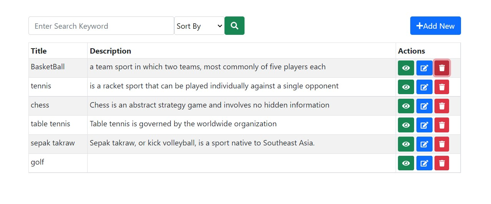

# Simple REACT-CRUD

> A simple react app that enable users to CREATE, READ, UPDATE & DELETE hobbies.

An open source project that demonstrates CRUD operations built with **React Hooks & Context API** as a state manager.



## Dependencies

- react-router-dom
- react-bootstrap
- axios
- Context API (state management)

## Features

- Search, Sort
- Wikipedia Third Party Data Integration
- CRUD Operations

## Usage

##### Clone the project

```
https://github.com/ivanhular/cell5-CRUD-frontend.git
```

##### Install dependencies

```
npm install
```

##### Run

```
npm start
```

##### Test

```
npm Test
```

## Release History

- 0.0.1
  - Added All features

## Meta

John Ivan Hular – [ivanhular@gmail.com](mailto:ivanhular@gmail.com)

Distributed under the XYZ license. See `LICENSE` for more information.

[https://github.com/ivanhular](https://github.com/ivanhular)
